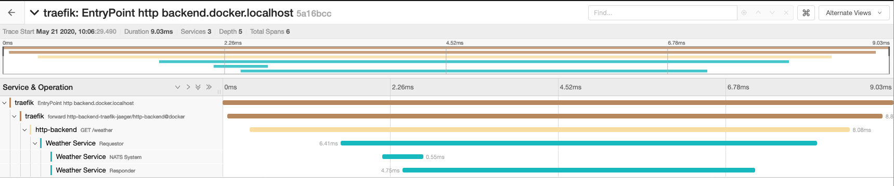

# 3. NATS Service Latency Distributed Tracing Interoperability

Date: 2020-05-21
Author: @ripienaar

## Status

Approved

## Context

The goal is to enable the NATS internal latencies to be exported to distributed tracing systems, here we see a small
architecture using Traefik, a Go microservice and a NATS hosted service all being observed in Jaeger.



The lowest 3 spans were created from a NATS latency Advisory.

These traces can be ingested by many other commercial systems like Data Dog and Honeycomb where they can augment the
existing operations tooling in use by our users. Additionally Grafana 7 supports Jaeger and Zipkin today.  

Long term I think every server that handles a message should emit a unique trace so we can also get visibility into
the internal flow of the NATS system and exactly which gateway connection has a delay - see our current HM issues - but
ultimately I don't think we'll be doing that in the hot path of the server, though these traces are easy to handle async

Meanwhile, this proposal will let us get very far with our current Latency Advisories.

## Configuring an export

Today there are no standards for the HTTP headers that communicate span context downstream - with Trace Context being
an emerging w3c standard.

I suggest we support the Jaeger and Zipkin systems as well as Trace Context for long term standardisation efforts.

Supporting these would mean we have to interpret the headers that are received in the request to determine if we should
publish a latency advisory rather than the static `50%` configuration we have today.

Today we have:

```
exports: [
    {
        service: weather.service 
        accounts: [WEB]
        latency: {
            sampling: 50% 
            subject: weather.latency
        }
    }
]
```

This enables sampling based `50%` of the service requests on this service.

I propose we support the additional sampling value `headers` which will configure the server to
interpret the headers as below to determine if a request should be sampled.

## Propagating headers

The `io.nats.server.metric.v1.service_latency` advisory gets updated with an additional `headers` field.

`headers` contains only the headers used for the sampling decision.

```json
{
  "type": "io.nats.server.metric.v1.service_latency",
  "id": "YBxAhpUFfs1rPGo323WcmQ",
  "timestamp": "2020-05-21T08:06:29.4981587Z",
  "status": 200,
  "headers": {
    "Uber-Trace-Id": ["09931e3444de7c99:50ed16db42b98999:0:1"]
  },
  "requestor": {
    "acc": "WEB",
    "rtt": 1107500,
    "start": "2020-05-21T08:06:20.2391509Z",
    "user": "backend",
    "lang": "go",
    "ver": "1.10.0",
    "ip": "172.22.0.7",
    "cid": 6,
    "server": "nats2"
  },
  "responder": {
    "acc": "WEATHER",
    "rtt": 1389100,
    "start": "2020-05-21T08:06:20.218714Z",
    "user": "weather",
    "lang": "go",
    "ver": "1.10.0",
    "ip": "172.22.0.6",
    "cid": 6,
    "server": "nats1"
  },
  "start": "2020-05-21T08:06:29.4917253Z",
  "service": 3363500,
  "system": 551200,
  "total": 6411300
}
```
 
## Header Formats

Numerous header formats are found in the wild, main ones are Zipkin and Jaeger and w3c `tracestate` being an emerging standard.

Grafana supports Zipkin and Jaeger we should probably support at least those, but also Trace Context for future interop.

### Zipkin

```
X-B3-TraceId: 80f198ee56343ba864fe8b2a57d3eff7
X-B3-ParentSpanId: 05e3ac9a4f6e3b90
X-B3-SpanId: e457b5a2e4d86bd1
X-B3-Sampled: 1
``` 

Also supports a single `b3` header like `b3={TraceId}-{SpanId}-{SamplingState}-{ParentSpanId}` or just `b3=0`

[Source](https://github.com/openzipkin/b3-propagation)

### Jaeger

```
uber-trace-id: {trace-id}:{span-id}:{parent-span-id}:{flags}
```

Where flags are:

 * One byte bitmap, as two hex digits
 * Bit 1 (right-most, least significant, bit mask 0x01) is “sampled” flag
   * 1 means the trace is sampled and all downstream services are advised to respect that
   * 0 means the trace is not sampled and all downstream services are advised to respect that

Also a number of keys like `uberctx-some-key: value`

[Source](https://www.jaegertracing.io/docs/1.17/client-libraries/#tracespan-identity)

### Trace Context

Supported by many vendors including things like New Relic

```
traceparent: 00-4bf92f3577b34da6a3ce929d0e0e4736-00f067aa0ba902b7-01
tracestate: rojo=00f067aa0ba902b7,congo=t61rcWkgMzE
```

Here the `01` of `traceparent` means its sampled.

[Source](https://www.w3.org/TR/trace-context/)

### OpenTelemetry

Supports Trace Context

[Source](https://github.com/open-telemetry/opentelemetry-specification/blob/master/specification/trace/api.md)

